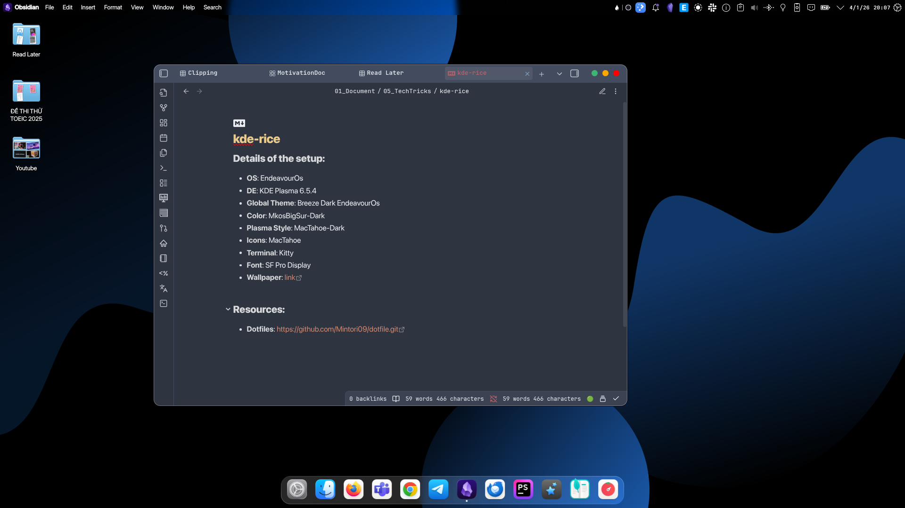

# Minimal-KDE: EndeavourOS Edition

> A text-focused, ultra-minimalist KDE Plasma 6 setup. Designed for distraction-free productivity.

## Highlights

- **Iconless Workflow**: Embracing a clean, text-based interface to reduce visual clutter.
- **Pure Consistency**: Leveraging the **MkosBigSur** color palette across all applications.
- **Modern Shell**: Powered by **Zsh** and **Kitty**, featuring a highly customized prompt.

---

## System Profile

| Component        | Details                            |
| :--------------- | :--------------------------------- |
| **OS**           | EndeavourOS                        |
| **DE**           | KDE Plasma 6.5.4                   |
| **Global Theme** | Breeze Dark EndeavourOS            |
| **Color Scheme** | MkosBigSur-Dark                    |
| **Plasma Style** | MacTahoe-Dark                      |
| **Terminal**     | Kitty                              |
| **Font**         | SF Pro Display / JetBrains Mono NF |

---
